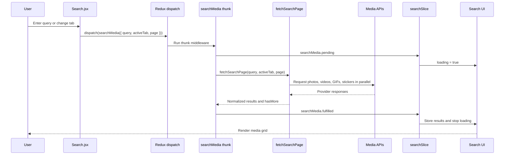

# Async Thunk and Thunk Middleware

This document explains how asynchronous Redux logic works in MediaSearch and why the API requests are handled with Redux Toolkit's `createAsyncThunk` instead of being written directly inside the React component.

## What Is a Thunk?

A thunk is a function that is allowed to receive `dispatch` and `getState` instead of being a plain Redux action object.

A normal Redux action is a plain object:

```js
{ type: "search/setQuery", payload: "nature" }
```

A thunk is a function that can perform work before dispatching one or more actions:

```js
const fetchData = () => async (dispatch, getState) => {
  dispatch({ type: "data/loading" });

  const response = await fetch("/api/data");
  const data = await response.json();

  dispatch({ type: "data/succeeded", payload: data });
};
```

The thunk itself does not become part of the Redux state. It is an instruction for Redux to run asynchronous or conditional logic and dispatch ordinary actions when that work is complete.

## What Is Thunk Middleware?

Redux normally expects `dispatch` to receive plain action objects. It cannot execute a function by itself.

Thunk middleware extends Redux's dispatch behavior:

```text
dispatch(plainAction) -> reducer updates state

dispatch(thunkFunction) -> middleware executes the function
                         -> thunk dispatches plain actions
                         -> reducers update state
```

The middleware is the bridge between Redux and asynchronous code. It allows an action creator to start an API request, wait for the response, handle errors, and dispatch the appropriate state updates.

This project uses Redux Toolkit's `configureStore`:

```js
const store = configureStore({
  reducer: {
    search: searchReducer,
    collection: collectionReducer,
  },
});
```

`configureStore` includes thunk middleware by default. No separate `redux-thunk` installation or manual middleware configuration is required.

## What Is `createAsyncThunk`?

`createAsyncThunk` is Redux Toolkit's standard helper for creating an async thunk. It accepts:

1. A unique action type prefix.
2. An async payload creator that performs the request.

```js
export const searchMedia = createAsyncThunk(
  "search/fetchMedia",
  async ({ query, activeTab, page = 1 }, { rejectWithValue }) => {
    try {
      return await fetchSearchPage(query.trim(), activeTab, page);
    } catch (error) {
      return rejectWithValue(error?.message || "Unable to fetch results");
    }
  },
);
```

For one dispatch, Redux Toolkit automatically creates three lifecycle actions:

| Lifecycle action        | Meaning                             |
| ----------------------- | ----------------------------------- |
| `searchMedia.pending`   | The request has started.            |
| `searchMedia.fulfilled` | The request completed successfully. |
| `searchMedia.rejected`  | The request failed.                 |

The slice handles those actions in `extraReducers`:

```js
extraReducers: (builder) => {
  builder
    .addCase(searchMedia.pending, (state) => {
      state.loading = true;
    })
    .addCase(searchMedia.fulfilled, (state, action) => {
      state.result = action.payload.results;
      state.loading = false;
    })
    .addCase(searchMedia.rejected, (state, action) => {
      state.loading = false;
      state.error = action.payload || action.error.message;
    });
};
```

## MediaSearch API Flow

The request flow currently works like this:



### Step-by-step

1. `Search.jsx` observes the current query and active tab from Redux.
2. When either value changes, the component dispatches `searchMedia` for page `1`.
3. Thunk middleware recognizes that the dispatched value is a function and executes it.
4. Redux Toolkit dispatches `searchMedia.pending`, so the slice sets `loading` to `true` and clears the previous error.
5. The thunk calls `fetchSearchPage` from `src/services/fetchSearchPage.js`.
6. `fetchSearchPage` decides which providers are needed and calls the selected APIs in parallel with `Promise.all`.
7. The provider responses are normalized into one consistent result format.
8. If the request succeeds, Redux Toolkit dispatches `searchMedia.fulfilled`.
9. The slice replaces the results for page `1`, or appends results for a later page.
10. If the request fails, Redux Toolkit dispatches `searchMedia.rejected` and stores the error message.
11. React re-renders because the Redux state changed.

### Loading More Results

The same thunk is reused for pagination:

```js
dispatch(
  searchMedia({
    query: query.trim(),
    activeTab,
    page: page + 1,
  }),
);
```

The slice checks the page number:

- Page `1`: replace the existing results and use `loading`.
- Page `2` or later: append to the existing results and use `loadingMore`.

This keeps the initial search request and pagination request consistent while allowing the UI to show the correct loading indicator.

## Why Use Thunk Middleware Instead of Calling the API Directly?

A direct component request can look like this:

```js
useEffect(() => {
  async function loadResults() {
    setLoading(true);

    try {
      const data = await fetchSearchPage(query, activeTab, 1);
      setResults(data.results);
    } catch (error) {
      setError(error.message);
    } finally {
      setLoading(false);
    }
  }

  loadResults();
}, [query, activeTab]);
```

That approach is valid for small, local UI behavior. However, thunk is usually more suitable when the request affects shared application state.

### 1. One source of truth

With direct API calls, loading, error, page, and results are usually local React state. Other components cannot easily access or update them.

With thunk, the request state lives in Redux:

```js
state.search.loading;
state.search.loadingMore;
state.search.error;
state.search.result;
state.search.page;
```

Any component can read the same state without duplicating the request logic.

### 2. Consistent request lifecycle

Every request follows the same predictable lifecycle:

```text
pending -> fulfilled
pending -> rejected
```

The reducers define exactly how each lifecycle state changes the UI. This avoids repeating `try/catch/finally` blocks in several components.

### 3. Cleaner components

`Search.jsx` is responsible for rendering the page and dispatching an intent:

```js
dispatch(searchMedia({ query, activeTab, page: 1 }));
```

The component does not need to know how many providers are called, how pagination is calculated, or how provider responses are normalized.

### 4. Better reuse

The same `searchMedia` thunk can be dispatched from:

- The search page.
- A refresh button.
- A route loader or another feature.
- Tests that verify request behavior.

A request implemented only inside one component is harder to reuse.

### 5. Centralized error handling

The thunk converts request failures into a consistent message with `rejectWithValue`. The slice stores that error in one predictable location, so the UI can display it consistently.

### 6. Easier testing and debugging

Redux DevTools can show the complete request lifecycle:

```text
search/setQuery
search/fetchMedia/pending
search/fetchMedia/fulfilled
```

This makes it easier to determine whether a problem occurred before the request, during the API call, or while updating state.

### 7. Shared business rules

Pagination and stale-response protection are application rules, not presentation details. Keeping them in the slice means they do not need to be reimplemented in every component that uses search results.

## Is Thunk Always Better?

No. Thunk is preferred when asynchronous work updates shared Redux state, but it is not required for every request.

Direct component logic can be a good choice when:

- The data is used by only one component.
- The request is tightly coupled to a short-lived UI interaction.
- The result does not need to be shared or inspected through Redux.
- A dedicated server-state library such as RTK Query or TanStack Query is already used.

For larger applications, RTK Query can be even more appropriate for server data because it provides caching, deduplication, invalidation, and request status management. Thunks remain useful for workflows that combine API calls with complex Redux state changes or other dispatched actions.

## Summary

- A thunk is a function that can perform work and dispatch actions.
- Thunk middleware allows Redux to dispatch and execute those functions.
- `createAsyncThunk` automatically creates `pending`, `fulfilled`, and `rejected` actions.
- MediaSearch uses `searchMedia` to keep API calls outside the React component.
- `fetchSearchPage` handles provider requests and normalization.
- `searchSlice` owns loading, error, result, and pagination state.
- Thunks are more maintainable than repeated direct API calls when request state is shared, reusable, or tied to Redux business logic.
